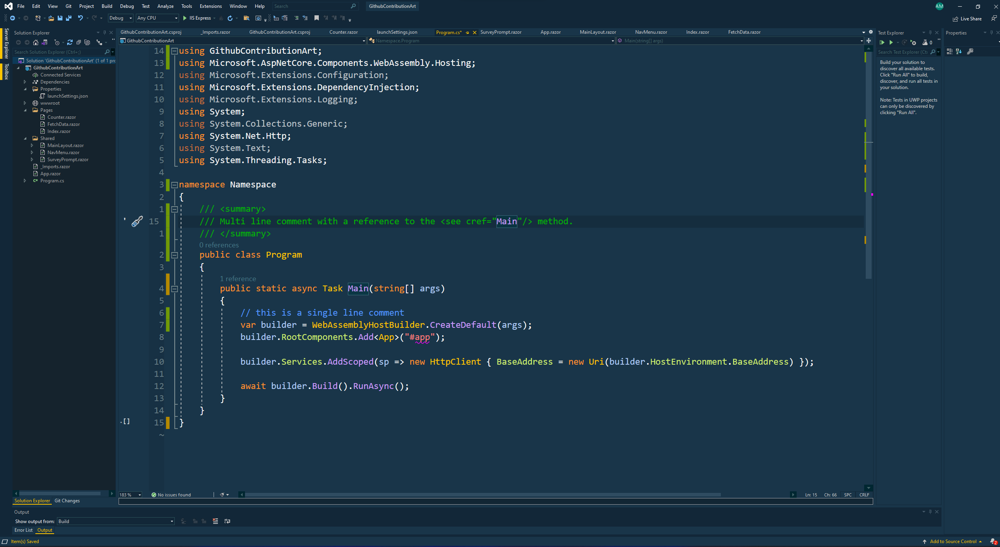
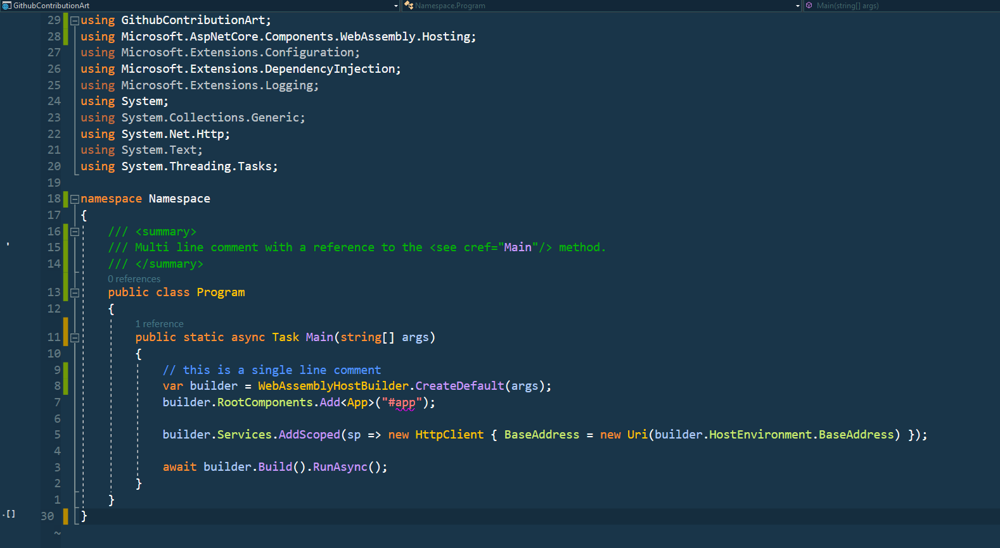
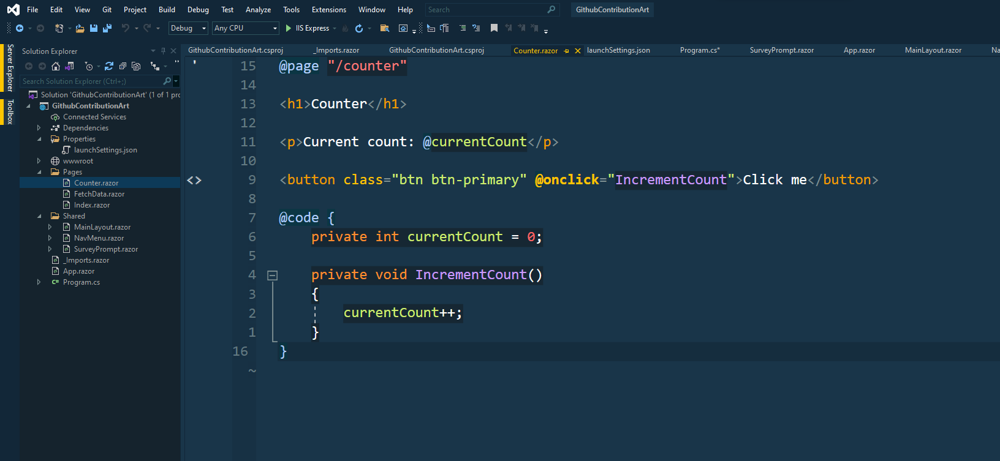
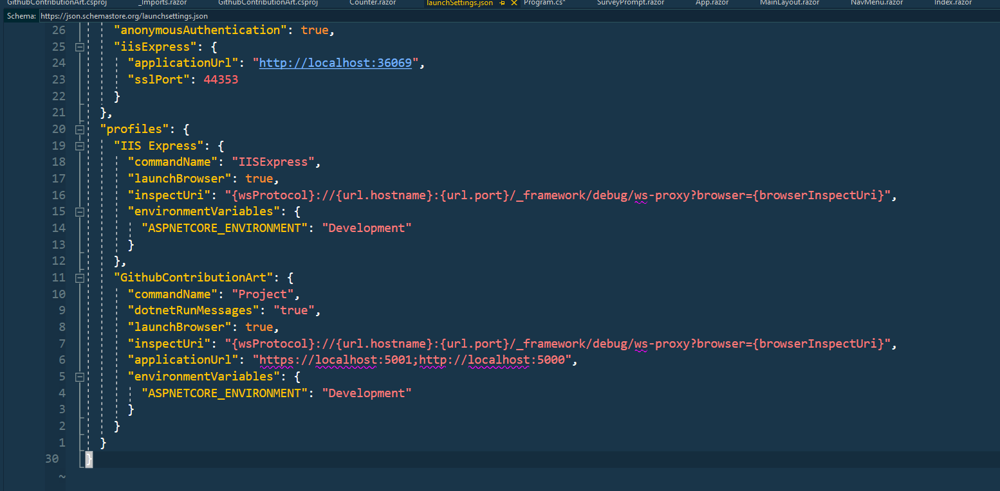
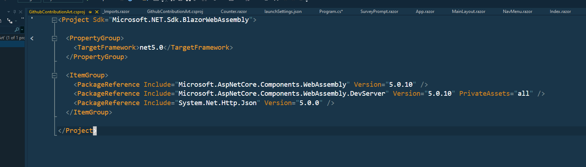

 

  
  
## Amiko dark is a Visual Studio color theme for developers with amazing taste!

---

## Make it yours by [downloading the extension from the Visual Studio store](https://marketplace.visualstudio.com/items?itemName=AmichaiMantinband.amikodark)

---

## Setup

Make sure you have the [Visual Studio Color Theme Designer extension](https://marketplace.visualstudio.com/items?itemName=ms-madsk.ColorThemeDesigner) installed.

1. `clone` the repo
2. Edit the `CustomTheme.vstheme` file as you wish.

---

## Contributing

Please go ahead and open an issue for any unreadable/ugly color you think should be fixed!
I'll be maintaining this extension so you can expect the changes to be quick and reflected in the extension in the Visual Studio store shortly.

---

## Credits

- Big shout out to the [Cobalt2 Theme](https://marketplace.visualstudio.com/items?itemName=SIBA.Cobalt2Theme) which was used as the base for this theme!

---

## License

This project is licensed under the terms of the [MIT](https://github.com/mantinband/amiko-dark/blob/main/LICENSE) license.